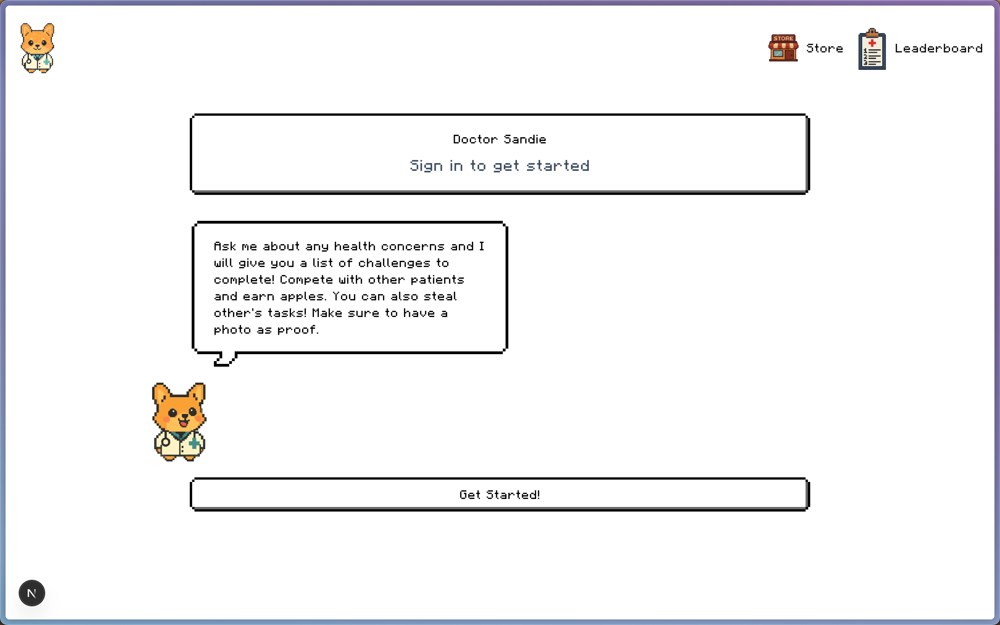
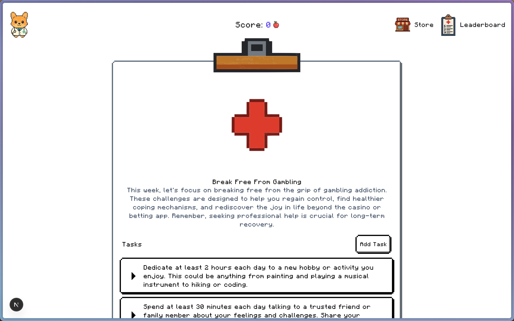
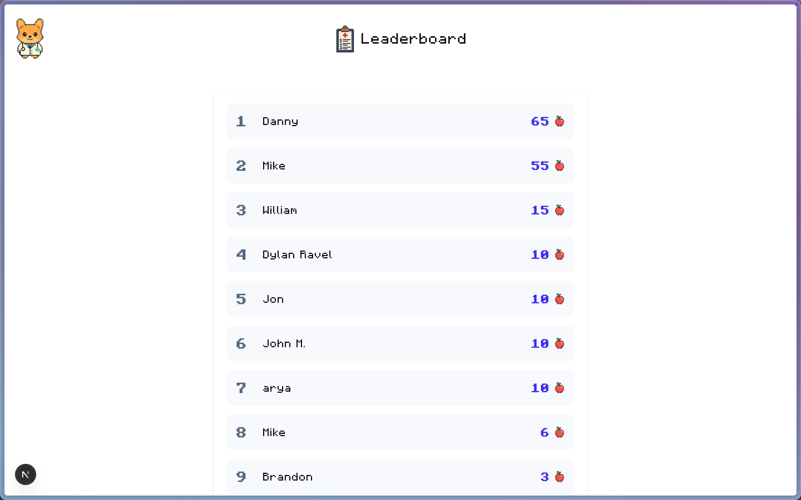
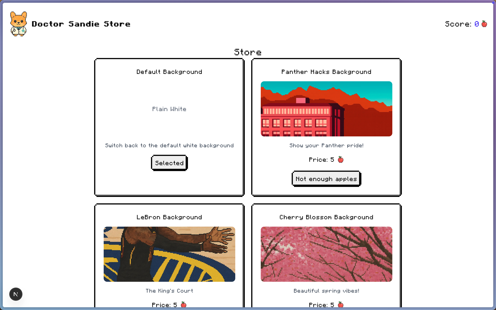

# AI Doctor Challenge Platform

An AI-powered medical challenge platform where patients compete with each other in real-time medical scenarios and health challenges. Get personalized medical advice and compete with other patients in an engaging, gamified healthcare experience.

## Features

- Real-time multiplayer medical challenges
- AI doctor providing personalized health advice
- Competitive patient leaderboards
- Interactive health assessments
- Live challenge rooms

## Screenshots

### Welcome Screen


### Challenge Interface


### Leaderboard


### Wallpapers Store


## Tech Stack

- **Frontend**: Next.js 14 with App Router
- **Backend**: Convex for real-time data synchronization
- **Hosting**: Vercel
- **Real-time Features**: Convex real-time database

## Getting Started

First, run the development server:

```bash
npm run dev
# or
yarn dev
# or
pnpm dev
# or
bun dev
```

Open [http://localhost:3000](http://localhost:3000) with your browser to see the result.

## About

This project was created for [**Panther Hacks 2025**](https://pantherhacks.dev/live) at Chapman University. It combines healthcare technology with gamification to create an engaging platform for medical education and patient interaction.

## Deploy on Vercel

The easiest way to deploy your Next.js app is to use the [Vercel Platform](https://vercel.com/new?utm_medium=default-template&filter=next.js&utm_source=create-next-app&utm_campaign=create-next-app-readme) from the creators of Next.js.

Check out our [Next.js deployment documentation](https://nextjs.org/docs/app/building-your-application/deploying) for more details.
